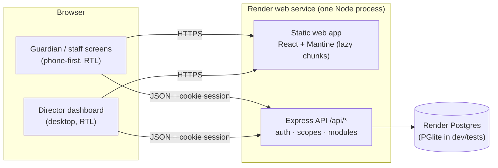

# Slash School — MVP Architecture

This describes the MVP as built. The product it implements is in
[`sketch-breakdown.md`](./sketch-breakdown.md), whose screen IDs (P3, S9, D4, …) are used
below. How to write code in this repo is in [`dev/conventions.md`](./dev/conventions.md).

---

## 1. Scope

**Principle:** the daily loop (staff record the school day, guardians see it), plus everything a
director needs to run a school on it. The product owner asked for immediate testing, so the MVP is
**web-first**. One deployable on Render serves:
- phone-first screens for guardians, supervisors and teachers;
- a desktop dashboard for the director.

### In the MVP

| Area | Guardian (`/g/:studentId`) | Supervisor / teacher (`/s/:schoolId`) | Director (`/a/:schoolId`) |
|---|---|---|---|
| Access | Activation code → PIN, phone + PIN login, child picker grouped by school, "+" link a child | Same login, school picker when a user has more than one school | Same login, school switcher |
| Lessons & homework | Subject grid with unread badges; lessons filtered by اليوم/الأسبوع/الشهر/الكل; homework with a "تم" tick | Add / edit / delete lessons with homework, due date and attachments | — |
| Attendance | Absences this month and this year, list of absent days | Record or edit absentees per class per day (supervisor) | تسجيل الغياب page, today's overview |
| Exams & grades | Quiz announcements with scores, exam timetables, published result sheets | Exam timetable builder, quiz announcements, grade entry, publish results | Results tab on the student page |
| Behavior | Violations, penalties, teacher evaluations | Record an incident (supervisor), rate students per subject (teacher) | Regulations catalog, behavior tab on the student page |
| Fees | Total, paid, remaining, installments with status, payments | — | Fee plans, assigning plans, payments, discounts, arrears, fee notice + WhatsApp |
| Announcements & calendar | Targeted inbox; month calendar with events | — | Compose to school / grade / class / one guardian; calendar CRUD |
| Timetables | — | Day builder with teacher-clash checks (supervisor); own schedule (teacher) | Weekly grid editor |
| People & setup | — | — | Students list, admission form (D3), CSV import, student page (D4), guardians, staff, structure (years, stages, grades, sections, subjects, assignments), settings (week start, grade bands), dashboard (D1) |
| Demo | One-tap role login, `/demo/:role` links, in-app role switcher, a rich demo dataset that reloads on deploy | | |

### Later

- Native apps (Expo, reusing the same API with Bearer tokens).
- Push notifications. In-app unread badges exist today.
- Online fee payment (Bankak / wallets) and the WhatsApp Business API. Today the app produces
  `wa.me` share links.
- Offline write queue, English UI, student logins.
- Transport (P17).
- File storage in S3/R2. Files are stored in Postgres today.

---

## 2. Decisions

The product owner decided that fees are recorded by hand. The rest were decided on their behalf
(see the sketch breakdown, §6):

1. **Login.** A school-issued, single-use activation code, 14-day expiry, sent as a WhatsApp link
   with the code prefilled. After activation the user picks a 4–6 digit PIN; later logins use
   phone + PIN, and 5 wrong PINs lock the account for 15 minutes.
2. **One web app** with role-based areas. Guardians hold the account; children are linked to them.
3. **Many schools on one deployment.** A user is global, identified by phone, with a membership per
   school and role.
4. **Teachers** act only on their assigned class × subject pairs. Supervisors and the director
   act on the whole school. Absence and behavior are recorded by supervisors and the director only.
5. **Computed numbers.** Fee balances, result totals, percentages and grades are always computed by
   the server.
6. **Results are published explicitly.** Guardians see a period's results only after publishing.
7. **Grade bands:** ≥ 90 ممتاز, ≥ 75 جيد جداً, ≥ 60 جيد, ≥ 50 مقبول. Week starts Sunday. Both are
   per-school settings.

---

## 3. System architecture

- **One deployable.** The Express server serves `/api/*` and the built web app (with an SPA
  fallback). The Render Blueprint (`render.yaml`) creates a free web service plus a free Postgres
  in Frankfurt and auto-deploys every push to `main`.
- **Boot sequence:** migrate, then, in demo mode, load the demo data when the database is empty or
  was seeded with an older demo version, then listen.
- **A modular monolith.** Each feature is a module with its own routers, service, schemas and
  tests. The data is small (thousands of students per school), so one database and one process is
  the right size.

## 4. Stack

| Layer | Choice |
|---|---|
| Language | TypeScript everywhere, npm workspaces |
| Shared | `packages/shared`: enums, Arabic labels, formatters, business rules (fees, results, date ranges) |
| API | Express 5, zod validation, Drizzle ORM, node-postgres; PGlite (embedded WASM Postgres) for dev and tests |
| Web | React 19, Mantine 8 (RTL), TanStack Query, React Router 7, dayjs (Arabic month names, Western digits) |
| Auth | Activation codes + PIN (scrypt), httpOnly cookie sessions (30 days), Bearer tokens accepted for future native apps |
| Tests | Vitest + supertest against in-memory PGlite (≈ 250 tests); a Playwright crawler over every screen of every role (`e2e/crawl.mjs`) |
| Hosting | Render Blueprint: web service + Postgres; `npm ci --include=dev && npm run build`, `npm start` |

## 5. Multi-tenancy and access control

- Every tenant table has `school_id`.
- **Staff routes** live under `/api/schools/:schoolId/*`. The `schoolScope` middleware requires a
  staff membership (admin / supervisor / teacher) there and sets `req.school`.
- **Guardian routes** live under `/api/students/:studentId/*`. The `studentScope` middleware
  allows:
  - the student's guardians;
  - the director and supervisors of the student's school;
  - teachers of the student's class.
- **Teacher scope** is enforced with `assertCanTeach` / `assertCanAccessClass`.
- **Every id from a client** is checked against the school before use.
- **Audit log** entries are written for scores, absences, payments, discounts, behavior incidents,
  student status changes and staff role removals.
- Every module's tests include cross-school, other-guardian and teacher-scope denials.

| Module | Guardian | Teacher | Supervisor | Director |
|---|---|---|---|---|
| Lessons & homework | read own children, tick homework | own pairs | all | all |
| Attendance | read | — | record / edit | record / edit |
| Exam timetables, publishing | read | read | write | write |
| Quizzes & scores | read | own pairs | all | all |
| Behavior incidents | read | — | write | write |
| Evaluations | read | own pairs | all | all |
| Regulations | — | read | write | write |
| Fees | read | — | read (student page) | write |
| Announcements | read targeted | — | read | write |
| Calendar | read | read | read | write |
| Timetables | — | own schedule, classes they teach | write | write |
| Students, guardians, staff, setup, settings, dashboard | — | — | read students | write |

## 6. Domain model

All tables are defined in `apps/api/src/db/schema.ts`, with migrations in `apps/api/drizzle/`.

| Group | Tables | Notes |
|---|---|---|
| Identity | `users`, `memberships`, `activation_codes`, `sessions` | User is global (unique phone); role per school |
| Structure | `schools`, `academic_years`, `stages`, `grade_levels`, `class_sections`, `subjects`, `teaching_assignments` | Section label = grade level + section ("الصف الخامس - ب") |
| People | `students`, `student_guardians` | Student name in 4 parts; current class on the student; guardians are users |
| Lessons | `lessons`, `lesson_attachments`, `files`, `homework_done` | Homework is part of a lesson; files (≤ 5 MB) stored in Postgres |
| Attendance | `attendance_sessions`, `absences` | One session per class per day; only absences stored |
| Assessment | `exam_periods`, `assessments`, `scores` | One assessment = one subject sitting for one class (exam row or quiz) |
| Behavior | `regulations`, `behavior_incidents`, `evaluations` | |
| Fees | `fee_plans`, `plan_installments`, `student_fees`, `payments` | Balances from `computeFeeAccount` (oldest-first allocation, discounts from the last installment) |
| Comms | `announcements`, `calendar_events`, `read_cursors` | Cursors per guardian × student × module (× subject) drive the badges |
| Other | `timetable_slots`, `audit_logs` | |

## 7. API surface

All endpoints return JSON. Errors are `{ error: { code, message (Arabic), details } }`.

| Area | Endpoints |
|---|---|
| Public | `GET /api/health`, `GET /api/public/config`, `POST /api/public/demo/login`, `POST /api/public/demo/reset` (the last two in demo mode only) |
| Auth | `POST /api/auth/activate`, `/set-pin`, `/login`, `/logout` |
| Me | `GET /api/me` (children + schools), `POST /api/me/children/link`, `POST /api/me/pin` |
| Shared lookups | `GET /api/schools/:id/lookups/scope`, `GET …/lookups/classes/:classId/students`, `POST …/files`, `GET /api/files/:fileId` |
| Lessons | `GET/POST/PATCH/DELETE /api/schools/:id/lessons`; guardian `GET /api/students/:id/subjects`, `/lessons`, `/homework`, `PUT /homework/:lessonId/done` |
| Attendance | `GET …/attendance/today`, `/sessions`, `GET/PUT …/attendance/:classId/:date`; guardian `GET …/students/:id/attendance` |
| Timetable | `GET …/timetable/mine`, `GET/PUT …/timetable/class/:classId[/:weekday]` |
| Assessment | `…/exam-periods` (CRUD, `/timetable`, `/publish`, `/results`), `…/assessments` (quizzes CRUD, `/scores`); guardian `/exams`, `/results`, `/results/:periodId` |
| Behavior | `…/regulations` (CRUD), `…/behavior` (incidents), `…/evaluations`; guardian `/behavior` |
| Fees | `…/fees/plans` (CRUD, `/assign`), `/students/:id`, `/student-fees/:id[/payments]`, `/payments/:id`, `/overview`, `/students/:id/notice`; guardian `/fees` |
| Comms | `…/announcements` (+ `/contacts/:studentId`), `…/calendar`; guardian `/summary` (header + badges), `/seen`, `/announcements`, `/calendar` |
| People | `…/students` (list, admission, edit, status, link code, guardians, import), `…/guardians`, `…/staff`, `…/setup/*`, `…/settings`, `…/dashboard` |

## 8. Demo mode

`DEMO_MODE=true` (set in `render.yaml`) enables:

- **One-tap role login** on the login page, shareable `/demo/guardian|teacher|supervisor|admin`
  links, and a floating role switcher with "reset demo data".
- **A deterministic demo dataset** (`apps/api/src/seed/demo*`), centred on today in Khartoum time:
  - two schools from the sketch, their staff and timetables;
  - a guardian with three children across both schools;
  - weeks of lessons, homework, attendance, exams and results, quizzes, behavior, evaluations,
    fees, announcements and calendar events.
  - It is built in memory and written in one transaction with multi-row inserts.
- **Automatic reloading.** The demo data reloads on boot when `DEMO_SEED_VERSION` changes, so a
  deploy always shows the latest demo data.

Set `DEMO_MODE=false` before real use.

## 9. Non-functional notes

- **Performance.** The guardian home is one summary request. Feature screens are lazy-loaded
  chunks. Images are compressed in the browser before upload.
- **Security.** Codes and PINs are hashed; logins are rate-limited; sessions are httpOnly cookies.
  Helmet sets a CSP that allows only Google Fonts. Activation codes are not issued for accounts that
  belong to another school or hold an admin role, because accounts are shared by phone number.
- **Free Render plan.** The service sleeps after about 15 minutes idle, and the free Postgres
  expires after 30 days. Upgrade both before a pilot.
- **Open policies:**
  - whether guardians of withdrawn or expelled students keep access (they currently do);
  - whether supervisors get read access to the director pages (currently director-only).
