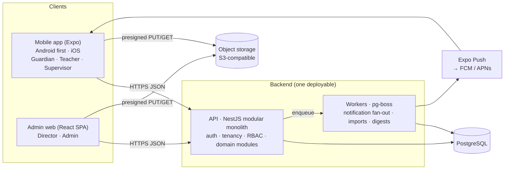
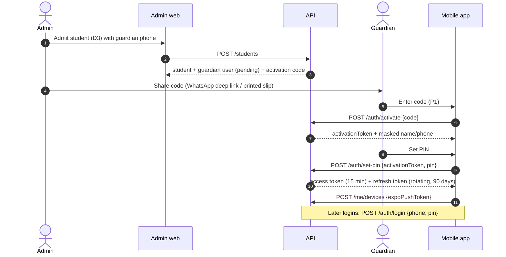
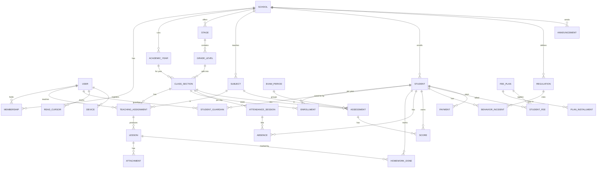

# Slash School — MVP Architecture

How to build the first shippable version of the product described in
[`sketch-breakdown.md`](./sketch-breakdown.md). Screen IDs used below (P3, S9, D4, …) refer to
that document.

---

## 1. MVP scope

**Principle:** the MVP is the daily loop. Staff record what happened, the guardian sees it and
gets notified. On top of that, the MVP includes the minimum admin work needed to put a real
school on the system. The sketch has 54 frames. Anything outside that loop waits until after
the pilot.

### In the MVP (v1)

| Area | Guardian app | Staff app (teacher / supervisor) | Admin web |
|---|---|---|---|
| **Onboarding** | Activation code + PIN (P1), child switcher grouped by school, "+" to link a child (P2), menu with badges (P3) | Code login, school switcher only when the user has more than one school | School setup: academic year, stages, grade levels, classes, subjects, teaching assignments. Staff/student/guardian CRUD, **CSV import**, issue and share activation codes |
| **Lessons & homework** | Subject grid, lessons/homework by subject with Today/Week/Month/All filters, mark homework done (P4–P7) | Add / list / edit / delete a lesson with homework and attachments (S4–S7, T3–T6) | Read-only |
| **Attendance** | Monthly and total absence counts, list of absent days (P8) | Supervisor records and edits absentees per class per day (S8–S10) | Per-student view, record absence |
| **Exams & grades** | Exam timetable, quiz announcements with scores, result sheets (P10–P13) | Exam timetable builder, quiz announcements, grade entry, publish results (S11–S14, T7) | Read-only |
| **Behavior** | Counts + incident list (P14) | Supervisor records an incident (S15) | Regulations catalog, record from the student page |
| **Fees** | Balance + installments (P9) | — | Fee plans, record payments, send a fee notice (D4) |
| **Announcements** | Inbox (P16) | — | Compose for the school / a grade / a class / one guardian |
| **Notifications** | Push + per-module and per-subject unread badges | Push | — |
| **Students admin** | — | — | List/search/filter (D2), admission form (D3), student page actions incl. withdraw/expel (D4), home counters (D1) |

### Fast follow (v1.1, after pilot feedback)

Academic calendar (P15), timetables (S16 builder + T8 teacher view), student evaluation (S17,
T9), transport (P17), dashboard charts (the gender split and statistics in D1), and the
undrawn admin pages (D5 and the rest of the sidebar).

### Later

Online fee payment (Bankak / mobile wallets), the WhatsApp Business API, an offline write
queue, an English UI, separate student logins, guardian↔teacher messaging, and PDF report
cards.

### Why this cut

- Fees ship in v1 even though they aren't part of the daily loop. Private-school directors are
  the paying customer, and fee tracking is what they feel most. The MVP version is a manual
  ledger, which is cheap to build.
- The v1.1 items are thin in the sketch (calendar = stock image, transport isn't in the menu),
  hidden from guardians (evaluation), or the most complex UI in the sketch (the timetable
  builder).
- CSV import is **not in the sketch, but it is required.** Nobody will hand-enter 3,523 students
  through D3.

---

## 2. Key product decisions (assumptions to confirm)

1. **Login uses a school-issued activation code plus a PIN, not SMS OTP.** The sketch's only
   login field is a code. Codes can be printed or shared over WhatsApp, with no SMS cost and no
   SMS-delivery problems. After activation the user sets a 4–6 digit PIN, and later logins use
   **phone + PIN**. A forgotten PIN means the school issues a new code.
2. **One mobile app for every mobile role.** The user's role decides the menu (P3, S3 and T2 are
   just different menus). This means one store listing and one codebase.
3. **Multi-tenant SaaS.** One deployment serves many schools. A person (identified by phone
   number) can belong to several schools, which covers P2 (children at two schools) and S2.
4. **The guardian is the account holder** and children are linked to them. "Student/Parent"
   is one experience. A student login (added later) is the same UI with a single child.
5. **Derived numbers are computed by the server,** never entered by hand: fee balances, totals,
   percentages and grades (see the inconsistencies in the sketch breakdown).
6. **Results are published explicitly.** Scores can be entered over several days, and guardians
   see a result sheet only once it is published.
7. **The exam timetable is structured data, not an image.** This lets it drive reminders,
   per-class views and score entry.

---

## 3. System architecture



**The backend is a modular monolith on purpose.** The data is small: one school is about
3.5k students and roughly 25 staff. A small team ships faster with one deployable, one
database and one transaction boundary. Module boundaries inside the codebase keep a later split
possible.

### API modules

| Module | Owns | Sketch screens |
|---|---|---|
| `identity` | Users, activation codes, PINs, sessions, devices | P1, S1, T1 |
| `tenancy` | Schools, memberships, roles, request school context | P2, S2 |
| `org` | Academic years, stages, grade levels, class sections, subjects, teaching assignments | Admin setup |
| `people` | Students, guardians, enrollments, admission, CSV import, status (active/withdrawn/expelled) | D2–D4 |
| `lessons` | Lessons, homework, attachments, homework completion | P4–P7, S4–S7, T3–T6 |
| `attendance` | Attendance sessions, absences | P8, S8–S10 |
| `assessment` | Exam periods, assessments (exams + quizzes), scores, result sheets, grade bands | P10–P13, S11–S14, T7 |
| `behavior` | Regulations, incidents | P14, S15 |
| `fees` | Fee plans, installments, student fee accounts, payments | P9, D4 |
| `comms` | Announcements, push notifications, unread counters | P3 badges, P16, D4 |
| `files` | Presigned uploads/downloads, image limits | Lesson media |
| `dashboard` | Counters and stats | D1 |
| `audit` | Who changed which score, absence, payment or incident | — |

---

## 4. Tech stack

| Layer | Choice | Why |
|---|---|---|
| Language | **TypeScript everywhere** | A small team uses one language. Request/response types are shared between the API and both clients. |
| Mobile | **Expo (React Native)** + expo-router, TanStack Query (with persisted cache), react-hook-form + zod, expo-notifications, expo-secure-store, expo-image-manipulator | One codebase for Android and iOS. **EAS Update** ships fixes over the air, which matters when users rarely update apps. RTL works out of the box. |
| Admin web | **React + Vite** SPA, **Mantine** (first-class RTL), TanStack Query + TanStack Table | An internal tool with no SEO needs. Mantine handles RTL forms and tables well. |
| API | **Node.js + NestJS**, OpenAPI generated from the contracts | Domain modules map to Nest modules. RBAC is enforced in guards. |
| Contracts | **zod** schemas in `packages/contracts` → OpenAPI → typed client | One source of truth for validation on both server and client. |
| Database | **PostgreSQL 16 + Prisma** (migrations) | Relational data with real constraints, and small volumes. |
| Jobs | **pg-boss** (queue stored in Postgres) | Notification fan-out and imports, with no Redis to run. |
| Files | **S3-compatible storage** (Cloudflare R2 in prod, MinIO locally), presigned URLs | Cheap egress and a portable API. |
| Push | **Expo Push Service** | No native FCM/APNs setup for the MVP. |
| Observability | Sentry (all three apps) + pino structured logs | — |
| Tooling | pnpm workspaces + Turborepo, ESLint, Prettier, Vitest, Supertest, Maestro (mobile smoke) | — |

> If the team is stronger in Flutter, replacing `apps/mobile` with Flutter changes nothing
> else: the API, contracts and database stay the same.

### Repository layout

```
slashSchool/
├── apps/
│   ├── api/            # NestJS modular monolith (+ pg-boss workers, same image)
│   │   └── src/modules/{identity,tenancy,org,people,lessons,attendance,
│   │                    assessment,behavior,fees,comms,files,dashboard,audit}
│   ├── mobile/         # Expo app — guardian / teacher / supervisor
│   └── admin/          # React + Vite director dashboard
├── packages/
│   ├── contracts/      # zod schemas + enums + permission matrix (shared)
│   ├── api-client/     # typed client + TanStack Query hooks (generated)
│   ├── i18n/           # Arabic strings (keys ready for English later)
│   └── config/         # eslint / tsconfig / prettier presets
├── docs/
├── docker-compose.yml  # postgres + minio for local dev
└── turbo.json
```

---

## 5. Multi-tenancy and access control

### Tenancy model

- **Shared database, `school_id` on every tenant table.** A `User` is global (unique phone
  number). A `Membership(user, school, role, scope)` grants access to one school.
- Each request runs in one school context: the `X-School-Id` header, checked against the
  user's memberships. Guardian requests are scoped by **student** instead, and the server
  resolves the student's school.
- **Isolation is enforced in two layers.**
  1. API guard → every repository call takes the request's `schoolId`. There is no
     unscoped query path.
  2. Postgres row-level security as a backstop (v1.1). The connection sets
     `app.school_id`, and RLS policies filter by it.
- **Authorization tests are part of the definition of done.** Examples: "a guardian of student
  A cannot read student B's lessons" and "a teacher cannot edit a lesson for a class they
  aren't assigned to".

### Roles and scopes

| Role | Scope |
|---|---|
| `guardian` | Only students linked through `StudentGuardian` |
| `teacher` | Only the (class section, subject) pairs in their `TeachingAssignment`s |
| `supervisor` | The whole school in v1. Optional limit to stages later (open question 9). |
| `admin` (director) | The whole school, plus setup, people, fees and announcements |
| `platform_admin` | Slash School staff: create schools and first admins |

### Permission matrix (v1)

R = read, W = create/edit, — = no access. "own" = within the user's scope.

| Module | Guardian | Teacher | Supervisor | Admin |
|---|---|---|---|---|
| Lessons & homework | R (own children) | W (own assignments) | W | R |
| Homework "done" | W | R | R | R |
| Attendance | R | — ¹ | W | W |
| Exam timetable | R | R | W | R |
| Quiz announcements | R | W (own subjects) | W | R |
| Scores | R (published only) | W (own subjects) | W + publish | R |
| Behavior incidents | R | — ¹ | W | W |
| Regulations catalog | — | R | R | W |
| Fees | R | — | — | W |
| Announcements | R (targeted to them) | — | — ² | W |
| Students / guardians / staff | — | R (own classes' rosters) | R | W |
| School setup | — | — | — | W |

¹ Pending open question 3. ² Pending open question 8. Both are single-line changes in the
matrix, which lives in `packages/contracts`.

---

## 6. Authentication



- **Activation codes:** 10 characters from an unambiguous alphabet (e.g., `K7QF-M2XD-9P`).
  They are single-use, expire after 14 days, and are stored hashed. Regenerating a code
  revokes the old one.
- **PINs:** hashed with argon2id. After 5 failed attempts the account is locked for 15 minutes,
  and every attempt is rate-limited per IP and per phone.
- **Tokens:** a short-lived JWT access token plus a rotating refresh token kept in
  `expo-secure-store`. Reuse of a refresh token revokes the whole session family.
- **"+" on P2:** `POST /me/children/link {code}` takes a student link code and attaches another
  child, possibly at another school.

---

## 7. Domain model



### Key fields

| Entity | Key fields | Notes |
|---|---|---|
| `School` | name, code, timezone (`Africa/Khartoum`), week_start, currency (`SDG`), grade_bands (json) | One row per tenant |
| `User` | phone (unique), full_name, pin_hash, status (`pending`/`active`/`locked`) | Global across schools |
| `Membership` | user, school, role, scope (json, nullable) | Gives a user access to one school |
| `ActivationCode` | user, code_hash, expires_at, used_at | — |
| `Stage` / `GradeLevel` / `ClassSection` | name (`روضة` / `الصف الخامس` / `ب`), order | "الخامس - ب" = grade level + section |
| `Subject` | name, grade_levels[] | The subject grid comes from the student's grade level (sketch issue 10) |
| `TeachingAssignment` | class_section, subject, teacher (user) | Drives teacher scope and the guardian subject grid |
| `Student` | code (`S-25`), name parts ×4, gender, birth_date, mother name/phone, status, registered_at | Name stored in 4 parts (Sudanese convention), plus a computed `full_name` |
| `Enrollment` | student, class_section, academic_year | Year-by-year promotion without losing history |
| `StudentGuardian` | student, user, relation (`father`, `mother`, …), is_primary; guardian profile: occupation, workplace, locality, residence, WhatsApp | Each guardian is a `User`. One without an activated account is just a contact. |
| `Lesson` | teaching_assignment, date, title, pages, details, has_homework, homework_details, homework_due | One form for every role (sketch issue 4) |
| `HomeworkDone` | lesson, student, done_at, by_user | The "تم" checkbox |
| `AttendanceSession` | class_section, date, recorded_by | Unique per (class, date). A session with no absences means "all present", which is different from "not recorded". |
| `Absence` | session, student, note | Only absences are stored. Presence is the default. |
| `ExamPeriod` | academic_year, grade_level, kind (`weekly`/`monthly`/`term`/`final`), name, results_published_at | "Monthly exams — November" |
| `Assessment` | exam_period (nullable), class_section, subject, kind (`quiz` or period kind), date, max_score, details | **One entity covers** a timetable row (S12), a quiz announcement (S13/P11) and grade entry (S14) |
| `Score` | assessment, student, score, entered_by | Unique per (assessment, student) |
| `Regulation` | school, code, title, default_penalty | "مخالفة الزي المدرسي" |
| `BehaviorIncident` | student, regulation, date, details, penalty, recorded_by | P14 counts = number of incidents / number of incidents with a penalty |
| `FeePlan` / `PlanInstallment` | academic_year, grade_level, total / seq, amount, due_date | — |
| `StudentFee` | student, fee_plan, discount | Sibling and other discounts |
| `Payment` | student, amount, paid_at, method, receipt_no, recorded_by | Amounts are integers in SDG |
| `Announcement` | title, body, audience_type (`school`/`grade_level`/`class_section`/`student`), audience_id, published_at, created_by | P16. `transport_route` is added in v1.1. |
| `ReadCursor` | user, student, module, subject (nullable), last_seen_at | Drives the red badges |
| `Device` | user, expo_push_token, platform, last_seen_at | — |
| `AuditLog` | actor, school, entity, entity_id, action, before, after, at | Written for scores, absences, payments, incidents and status changes |

---

## 8. Business rules

**Badges (P3, P4, P6).**
- The badge count is the number of items created after the matching `ReadCursor.last_seen_at`,
  per (guardian, student, module[, subject]).
- Opening a list calls `POST /students/:id/seen`.
- The home screen gets every badge from a single `GET /students/:id/summary` call.

**Lesson filters.** Today / This week / This month are computed in the **school's timezone**,
and weeks start on `School.week_start`.

**Homework.** Homework belongs to a lesson. Completion is tracked per student. If both a
guardian and (later) the student account can tick it, the last write wins.

**Attendance.**
- `PUT /classes/:id/attendance/:date` with `{absentStudentIds}` is an **idempotent upsert**.
  This lets S9 (record) and S10 (edit) share one endpoint, and makes retries on a flaky
  network safe.
- Every change is audited.
- Counts in P8:
  - "This month" counts absences in the current calendar month.
  - "Total" counts absences in the current academic year.

**Results.**
- A result sheet is generated for each (student, exam period). It contains:
  - per-subject `score / max_score`;
  - `total = Σ score` and `max = Σ max_score`;
  - `percentage = total / max`;
  - the grade, read from `School.grade_bands`.
- Default grade bands, to be confirmed with the school:
  - ≥ 90 ممتاز
  - ≥ 80 جيد جداً
  - ≥ 65 جيد
  - ≥ 50 مقبول
  - otherwise ضعيف
- Visibility to guardians:
  - Period results are visible only after `results_published_at`.
  - A quiz score is visible once it has been entered.

**Fees.**
- Balance = (plan total − discount) − Σ payments.
- Payments are allocated to installments **oldest first**, which gives each installment's paid
  amount and arrears.
- Installment status:
  - `paid` if fully covered;
  - `late` if `due_date` has passed and it isn't fully paid;
  - `upcoming` otherwise.
- Nothing in P9 is stored as a typed-in number.

**Announcements.**
- A guardian sees announcements whose audience covers any linked child: the whole school, that
  child's grade level, that child's class section, or that child directly.
- Publishing enqueues a push fan-out job.

**Student status.**
- "Expel" (D4) is a status change (`expelled`), with a reason and an audit entry. Data is kept.
- An expelled student's guardian loses access to new content but keeps read access to past
  records (a policy to confirm).

---

## 9. API surface (v1)

These conventions apply to every endpoint:
- REST + JSON under `/v1`, with an OpenAPI spec generated from `packages/contracts`.
- Lists use cursor pagination with a default page of 20.
- Errors are `{ code, message, details }`, with Arabic messages coming from i18n keys.
- Staff and admin endpoints take `X-School-Id`. Guardian endpoints are scoped by `:studentId`.

**Auth & me**
```
POST /auth/activate            {code}                 → activationToken, preview
POST /auth/set-pin             {activationToken, pin} → tokens
POST /auth/login               {phone, pin}           → tokens
POST /auth/refresh | /auth/logout
GET  /me                       → user, memberships[{school, role}], children[{student, school, class}]
POST /me/children/link         {code}
POST /me/devices               {expoPushToken, platform}
```

**Guardian (student-scoped)**
```
GET  /students/:id/summary                         → badges per module/subject, header info (P3)
GET  /students/:id/subjects                        (P4, P6)
GET  /students/:id/lessons?subjectId&range         range = today|week|month|all (P5)
GET  /students/:id/homework?subjectId&range        (P7)
PUT  /students/:id/homework/:lessonId/done         {done}
GET  /students/:id/attendance                      → {thisMonth, total, days[]} (P8)
GET  /students/:id/fees                            → {total, discount, paid, remaining, installments[]} (P9)
GET  /students/:id/exam-timetables                 (P10)
GET  /students/:id/quizzes                         (P11)
GET  /students/:id/results  |  /results/:periodId  (P12, P13)
GET  /students/:id/behavior                        → {violations, penalties, incidents[]} (P14)
GET  /students/:id/announcements                   (P16)
POST /students/:id/seen                            {module, subjectId?}
```

**Staff (teacher / supervisor)**
```
GET    /staff/assignments                          → classes × subjects I can act on
GET    /classes/:id/students
POST   /lessons | GET /lessons?classId&subjectId | PATCH /lessons/:id | DELETE /lessons/:id
POST   /uploads/presign                            {contentType, size} → {url, key}
GET|PUT /classes/:id/attendance/:date              {absentStudentIds[]}
POST   /exam-periods | PUT /exam-periods/:id/timetable | POST /exam-periods/:id/publish
POST   /assessments                                (quiz announcement)
GET|PUT /assessments/:id/scores                    {scores:[{studentId, score}]}
GET    /regulations | POST /behavior-incidents
```

**Admin**
```
CRUD   /academic-years /stages /grade-levels /class-sections /subjects /teaching-assignments
CRUD   /students /staff /guardians
POST   /students/import                            (CSV → validation report → commit)
PATCH  /students/:id/status                        {status, reason}
POST   /users/:id/activation-code                  → code + WhatsApp share link
CRUD   /fee-plans | POST /students/:id/payments | POST /students/:id/fee-notice
CRUD   /announcements | /regulations
GET    /dashboard/stats                            (D1 counters)
```

---

## 10. Client structure

### Mobile (expo-router)

```
app/
├── (auth)/activate.tsx · set-pin.tsx · login.tsx
├── select.tsx                         # P2 child picker / S2 school picker (skipped if only one)
├── (guardian)/[studentId]/
│   ├── index.tsx                      # P3 menu + badges (one /summary call)
│   ├── lessons/index.tsx · [subjectId].tsx
│   ├── homework/index.tsx · [subjectId].tsx
│   ├── attendance.tsx · fees.tsx · behavior.tsx · announcements.tsx
│   ├── exams/index.tsx · quizzes.tsx · timetable.tsx
│   └── results/index.tsx · [periodId].tsx
└── (staff)/
    ├── index.tsx                      # S3 / T2 menu, filtered by role
    ├── lessons/index.tsx · new.tsx · [id].tsx
    ├── attendance/[classId]/[date].tsx
    ├── exams/index.tsx · timetable.tsx · quiz-new.tsx
    ├── grades/[assessmentId].tsx
    └── behavior/new.tsx
```

- **RTL and Arabic.**
  - `I18nManager.forceRTL(true)`, with an Arabic UI font (IBM Plex Sans Arabic or Cairo).
  - Western digits, matching the sketch.
  - Dates shown as `d/M/yyyy`. Amounts in SDG with thousands separators.
- **Shared header** component: back button, person name, school name, red screen title.
- **Low bandwidth.**
  - The TanStack Query cache is persisted to MMKV, so guardians see their last data offline,
    with a "last updated" stamp.
  - Images are compressed on the device before upload (long edge 1600px, about 300 KB or
    less).
  - Lists are paginated.
- **Forms** use react-hook-form + the zod schemas from `packages/contracts`, so both sides
  apply the same validation.

### Admin web

- RTL layout with the sidebar from D1.
- v1 pages:
  - Home: counters only.
  - Students: list, admission form, student page with actions.
  - Staff (teachers and supervisors): list and form.
  - Guardians: list.
  - Setup: years, stages, grades, classes, subjects, assignments.
  - Fees: plans and payments.
  - Announcements and Regulations.
  - Import wizard.
- "Message guardian" and "Fee notice" (D4) create a targeted announcement + push. They also
  offer a **WhatsApp deep link** (`wa.me/<phone>?text=…`) as a free, zero-integration channel.

---

## 11. Non-functional requirements

| Concern | MVP target / approach |
|---|---|
| Performance | API p95 < 300 ms. Guardian home = 1 request. Payloads paginated. Usable on 3G. |
| Availability | One region and one API instance + managed Postgres. A brief outage is acceptable in a pilot. |
| Connectivity | Persisted read cache. Idempotent writes (attendance, scores) so retries are safe. Form state is kept when a submit fails. (Offline write queue: later.) |
| Security | TLS everywhere. Hashed codes and PINs. Rate limits. Short-lived presigned URLs. Tenant + role checks on every route. |
| Privacy (minors) | Least-privilege scopes. No public file URLs. Audit log on sensitive edits. A data-retention policy for withdrawn students. |
| Backups | Daily automated backups + point-in-time recovery from the managed provider. A restore drill before the pilot. |
| Observability | Sentry in all three apps. Request logs carry a request id, user id and school id. Uptime check. |
| Testing | Unit tests for the business rules (fees allocation, results, badges, date ranges). API integration tests against a real Postgres, including **authorization tests**. Maestro smoke tests for login → menu → one flow per role. |
| Localization | Arabic only in v1. Every string goes through `packages/i18n` keys from day one. |

---

## 12. Environments and delivery

- **Local:** `docker compose up` (Postgres + MinIO), `pnpm dev` runs the API, admin and Expo
  together.
- **CI (GitHub Actions):** lint → typecheck → unit → API integration (Postgres service) → Prisma
  migration check. On `main`, it builds the API Docker image and the admin static bundle.
- **Staging / Production:**
  - The API + worker run from the same Docker image.
  - Managed Postgres, an S3-compatible bucket, and the admin SPA on a CDN.
  - Mobile ships through EAS Build (Play Store first, plus a direct-APK fallback), and fixes
    go out through EAS Update.
- **Portability:** check that every chosen provider (hosting, push, app store developer
  account, payments) serves Sudan-based accounts and users. Keep everything Docker-based, so
  the stack can move to another host without code changes.

---

## 13. Milestones (rough, for a team of about 2 developers)

| Milestone | Contents | Size |
|---|---|---|
| **M0 Foundations** | Monorepo, CI, contracts package, DB schema (core), auth (code + PIN), tenancy + RBAC guards, admin shell, mobile shell with RTL + shared header | ~2 weeks |
| **M1 School setup** | Admin setup CRUD, admission form, **CSV import**, activation codes + WhatsApp share, role-based mobile menus, child/school picker | ~2 weeks |
| **M2 Daily loop** | Lessons + homework (staff + guardian), attendance, announcements, push + badges | ~3 weeks |
| **M3 Assessment & behavior** | Exam periods + timetable, quizzes, score entry, publish results, result sheets, behavior | ~2 weeks |
| **M4 Fees & pilot hardening** | Fee plans, payments, fee notices, audit log, backups, Sentry, performance pass. **Pilot with one school** (the sketch uses "مدرسة أولاد عمار") | ~2 weeks |

That puts the pilot about **11 weeks** out. v1.1 (calendar, timetables, evaluation, transport,
dashboard charts) follows, prioritized by pilot feedback.

---

## 14. Risks

| Risk | Mitigation |
|---|---|
| Data entry is too much work for staff, so adoption stalls | CSV import. Absence-only attendance. Copy the last lesson. Big touch targets. Defaults everywhere. |
| Unreliable connectivity and power | Cached reads, small payloads, idempotent writes, OTA fixes. |
| Provider availability for Sudan (hosting, push, stores, payments) | Check each provider before committing to it. Docker-portable infrastructure. Direct-APK fallback. |
| Leaking minors' data across families or schools | Two-layer tenant isolation, authorization tests in CI, audit log. |
| Scope creep (the sketch has 54 frames) | Hold the v1 line in §1. New asks go to v1.1 unless a pilot school blocks on them. |
| Guardian activation drop-off | Codes shared through WhatsApp by the school. One-screen activation. Push the first announcement right after activation. |

---

## 15. Open questions

See [`sketch-breakdown.md` §6](./sketch-breakdown.md#6-open-questions-for-the-product-owner).
The ones that change the build are **#1 (what the login code is)**, **#3 (teacher
permissions)** and **#5 (online payments)**. The rest only change configuration or the
permission matrix.
